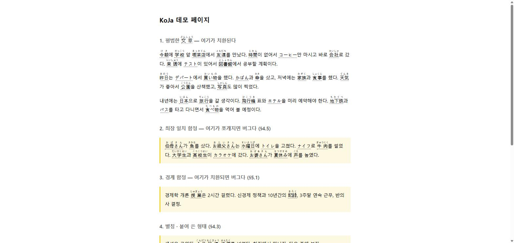
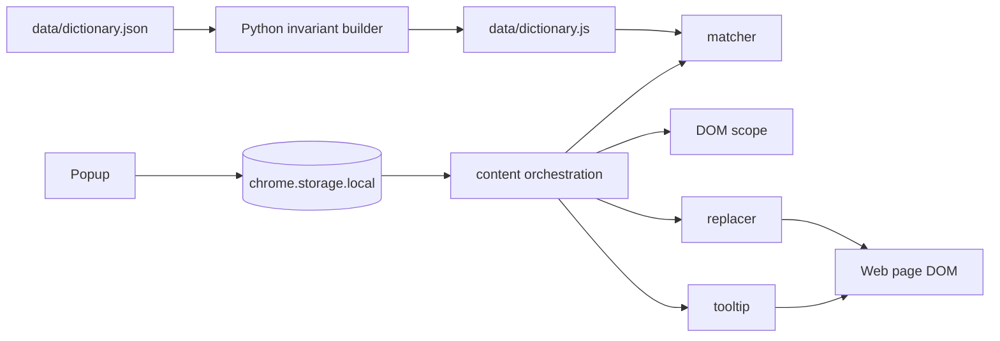

# KoJa

**한국어 웹페이지의 일부 명사를 일본어 표기와 후리가나로 바꿔, 웹서핑 중 JLPT 어휘 노출을 만드는 Chrome Manifest V3 확장입니다.**

핵심 구현은 2026-08-19 약 13시간의 바이브코딩 특강 3인 해커톤에서 진행했고, 이후 통합·문서·정확성
hardening이 이어졌습니다. Claude Code를 적극적으로 사용한 AI-assisted 프로젝트이며, 빠르게 생성한
산출물을 인터페이스 계약과 재현 가능한 검증으로 통합하는 데 초점을 뒀습니다.



## Project Overview

- Chrome Manifest V3의 선언형 content script 6개를 의존 순서대로 로드합니다.
- `data/dictionary.json`에 646개 엔트리와 677개 매칭 표면형(대표 646 + 별칭 31)을 번들합니다.
- 확장 런타임 의존성과 outbound network call은 모두 0이며 번역 API·LLM·telemetry를 사용하지 않습니다.
- 최장 일치, 한국어·숫자·영문 경계, 조사 허용 규칙으로 명사 표면형을 결정적으로 찾습니다.
- 밀도 0~100%를 무작위 없이 누적 quota로 적용하고, 같은 입력과 설정에는 같은 결과를 냅니다.
- 원래 표면형을 보존해 치환을 되돌리고, MutationObserver로 선택된 본문 아래의 새 텍스트를 처리합니다.
- 현재 `npm test` 39건과 GitHub Actions CI가 matcher·사전·content lifecycle·manifest 계약을 검사합니다.

## How It Works



팝업과 content script는 `enabled`, `furigana`, `level`, `density` 네 키를 공유합니다. 메시지 경로를
추가하지 않고 `chrome.storage.onChanged` 하나로 설정 변경을 반영합니다. 사전 정본은 Python builder가
불변식 8종을 확인한 뒤 확장용 JavaScript와 부분 문자열 회귀 데이터로 생성합니다.

## Key Engineering Decisions

### 1. 형태소 분석기 없이 한국어 경계 맞추기

명사 뒤 조사는 허용하되, 앞뒤에 한글·숫자·영문이 이어지는 부분 문자열은 제외합니다. 표면형을 길이
내림차순으로 컴파일해 「아주머니」를 「주머니」로 쪼개지 않고, 빌드가 찾은 부분 문자열 74쌍을 회귀
테스트로 고정했습니다.

| 입력 | 결과 | 이유 |
| --- | --- | --- |
| `경제가 나빠졌다` | `経済가 나빠졌다` | 조사 `가` 허용 |
| `경제학 개론` | 치환하지 않음 | 뒤 한글 경계 |
| `신경제 정책` | 치환하지 않음 | 앞 한글 경계 |
| `2시간 걸렸다` | 치환하지 않음 | 앞 숫자 경계 |

별칭으로 매치해도 대표 표제어가 아니라 페이지에 실제 있던 `surface`를 tooltip과 복원 데이터에 남깁니다.

### 2. 백분율 의미를 지키는 deterministic density

`Math.random()` 대신 후보의 전역 index 전후에서 누적 기대 선택 수가 증가하는지를 비교합니다. UI가
허용하는 0, 5, …, 100% 모두 100개 후보에서 해당 개수를 정확히 고르며, 텍스트 노드가 달라도 하나의
running candidate sequence를 사용합니다. 설정 변경이나 rerender 뒤에도 같은 문서는 같은 결과가 됩니다.

### 3. 되돌릴 수 있는 DOM mutation

치환 span은 `data-ko`와 `data-kana`에 실제 표면형과 읽기를 보존합니다. 끄기·레벨·밀도 변경 시 span을
텍스트 노드로 복원하고 부모의 `normalize()`를 호출해 반복 rerender에서 DOM 조각이 누적되지 않게 합니다.
`input`, `textarea`, `contenteditable`, `pre/code`, `script/style`, `ruby/rt`, `aria-hidden`, navigation은
스캔에서 제외합니다.

### 4. 동적 페이지의 observer lifecycle

로드 직후와 지연 scan 뒤 본문 root를 관찰하고, 확장이 만든 `.koja-word` mutation은 다시 처리하지
않습니다. 비활성화 시 observer를 끊으며, 이미 예약된 시작 callback도 `enabled`를 다시 확인합니다.
사전 엔트리별 첫 등장 정책과 페이지당 200개 상한은 재스캔에도 유지됩니다.

## Validation

### Current automated validation

| 검사 | 현재 결과 |
| --- | --- |
| `npm test` | 39 passed / 0 failed / skipped·todo 0 |
| 사전 | 646 entries · 677 surfaces · 542 ruby · 74 substring pairs · invariants 8종 |
| 정적 검사 | tracked JavaScript/MJS syntax와 manifest 참조·로드 순서 검사 |
| 생성 재현성 | Python 3.12 rebuild 뒤 `dictionary.js`와 `substring-pairs.json` drift 0 |
| CI | push와 pull request에서 위 검사를 GitHub Actions로 실행 |

### Historical manual validation

2026-08-19 해커톤 당시 자체 데모, 한국어 위키백과, Daum 뉴스 페이지에서 N1·밀도 100% 조건을 수동
확인했습니다. 네 가지 명백한 오치환을 찾아 matcher 예외·엔트리/별칭 제거와 회귀 테스트로 처리했습니다.
이는 당시 개발 환경의 기록이며 현재 자동 browser E2E 결과가 아닙니다.

상세 측정은 [`docs/misfires.md`](docs/misfires.md)와
[`docs/d3-3-safety.md`](docs/d3-3-safety.md)에 남아 있습니다. 수동 검증에 사용한 외부 페이지 전체
snapshot은 current tree에서 제거했고 기존 Git history는 보존했습니다.

## Quick Start

```bash
git clone https://github.com/Jossi02/chrome-jlpt-word-replacer.git
cd chrome-jlpt-word-replacer
npm test
```

`npm install`은 필요하지 않습니다. `chrome://extensions`에서 개발자 모드를 켜고 **압축해제된 확장
프로그램을 로드**한 뒤 이 폴더를 선택합니다.

자체 데모를 볼 때만 선택적으로 정적 서버를 실행합니다. Python은 확장 런타임 의존성이 아닙니다.

```bash
python -m http.server 8000
# http://localhost:8000/demo/sample.html
```


## Permissions and Privacy

- manifest permission은 `storage` 하나이며 설정 네 키를 로컬에 저장합니다.
- content script의 match 범위는 `<all_urls>`입니다. 따라서 설치 시 모든 사이트의 텍스트를 읽고 변경할 수
  있다는 site access 경고가 표시될 수 있으며, 이는 manifest permission 목록과 별개의 범위 선언입니다.
- 확장 런타임 outbound network call, telemetry, analytics는 0이고 페이지 텍스트를 외부로 보내지 않습니다.
- 역사 발표 문서가 외부 font를 불러오는 동작은 확장 런타임과 별개입니다.

## Team Collaboration and AI Use

아래는 [`OWNERS.md`](OWNERS.md), PR과 파일 history가 함께 지지하는 original hackathon ownership
요약입니다. 모든 로컬 Git author identity와 GitHub 계정의 일대일 대응까지 단정하는 표는 아닙니다.

| 담당 | Original hackathon ownership |
| --- | --- |
| A / [@kimminje2](https://github.com/kimminje2) | matcher와 matcher/dictionary tests, 초기 Claude 협업 harness, icon 기여 |
| B / [@hersmen98](https://github.com/hersmen98) | `scope.js`, `replacer.js`, `tooltip.js`, `content.js` |
| C / [@Jossi02](https://github.com/Jossi02) | data/build pipeline, manifest/package shell, popup/CSS, demo/docs, integration·maintenance |

기능 lane은 주로 PR로 통합했고, 이후 integration·documentation·maintenance에는 직접 commit도
포함됩니다. `OWNERS.md`는 현재 유지보수자를 강제하는 정책이 아니라 당시 파일 분담 기록입니다.

Claude Code는 설계·구현·검토에 적극 사용했습니다. 생성 결과를 사실로 전제하지 않고 모듈 시그니처,
사전 불변식, Node tests, 당시 수동 확인으로 교차 검증했습니다. 현재 shared settings에는 post-edit syntax
check와 stop-time test/review gate가 활성화되어 있고, owner guard·lane template·CHANGELOG-INBOX는
당시 병렬 협업을 설명하는 historical opt-in tooling으로 보존합니다.

## Known Limitations

- 형태소 분석기가 아닌 경계·조사 heuristic이므로 새로운 문맥 오탐이 생길 수 있습니다.
- 선택한 본문 root 아래의 mutation은 처리하지만 SPA가 root 자체를 교체하면 자동으로 다시 찾지 않습니다.
- 실제 사이트 검증은 2026-08-19의 역사 기록이며 현재 자동화된 Chrome E2E suite는 없습니다.
- 사전 생성물은 재현 가능하지만 당시 참고한 외부 어휘 자료의 정확한 revision·license provenance는 현재
  저장소만으로 완전히 재구성되지 않습니다.
- Chrome Web Store에 배포·심사된 확장이 아니며, 설치 시 `<all_urls>` site access가 필요합니다.

## Project History and Design Records

- [`SPEC.md`](SPEC.md) — 현재 계약과 역사적 설계 결정
- [`plan.md`](plan.md), [`tasks.md`](tasks.md) — 2026-08-19의 historical development artifacts
- [`docs/misfires.md`](docs/misfires.md) — 당시 수동 실측과 오치환 처리 기록
- [`docs/d3-3-safety.md`](docs/d3-3-safety.md) — 당시 안전성 점검 기록
- [`OWNERS.md`](OWNERS.md) — original ownership과 historical collaboration tooling
- [`docs/THIRD_PARTY.md`](docs/THIRD_PARTY.md) — 외부 검증 자료와 사전 provenance 범위

## Rights and Provenance

저장소 전체에 적용되는 오픈소스 라이선스는 현재 명시되어 있지 않습니다. 공동 기여자 합의와 사전 참고
자료 provenance를 확인한 뒤 별도로 결정해야 합니다. 자세한 현재 범위는
[`docs/THIRD_PARTY.md`](docs/THIRD_PARTY.md)에 기록했습니다.

---

Chrome MV3 · plain JavaScript · `node --test` · Python 3.12 dictionary builder · runtime dependencies 0
