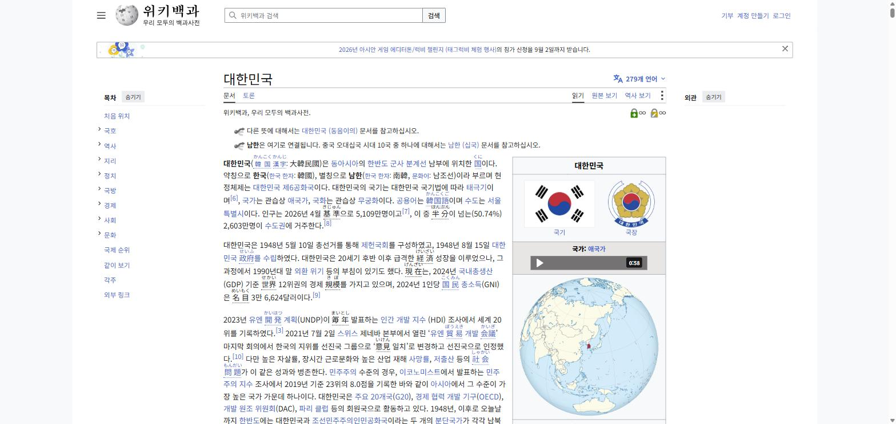
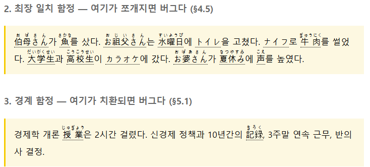
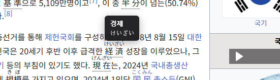
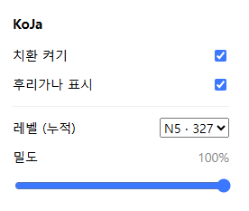
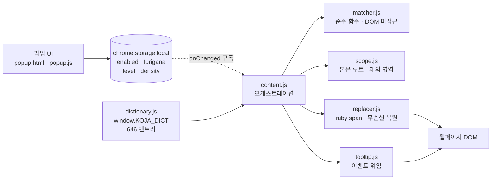

# KoJa

**한국어 웹페이지의 명사를 일본어 표기와 후리가나로 치환하는 Chrome 확장**

KoJa는 별도의 암기 시간을 들이지 않고 평소 웹서핑 중에 일본어 어휘 노출량을 만드는 방법을 탐구한
2026년 대학 팀 프로젝트입니다.

### 프로젝트 핵심 정보

- 2026년 대학 팀 프로젝트(3인 · 달력 3일)
- Chrome Manifest V3 확장, **런타임 네트워크 호출 0건**(번역 API·LLM 미사용)
- 사전 646 엔트리 / 677 표면형, 빌드 시 불변식 8종 자동 검증
- 레인 C(데이터·셸·UI) 담당 및 **통합자**
- 사전 빌드 파이프라인, 팝업 UI, 시연 페이지, 파일 단위 소유권 하네스 구현
- 3사이트 실측을 통한 오탐 4건 발견 및 제거

> 이 문서는 저장소의 실제 코드와 검증 기록을 기준으로 작성했습니다. 요구사항·설계 근거는
> [`SPEC.md`](SPEC.md), 인터페이스 계약은 [`plan.md`](plan.md), 진행 상태는 [`tasks.md`](tasks.md)를
> 기준으로 했습니다. 현재 버전은 v0.1.0이며 Chrome 웹스토어에 등록하지 않은 개발자 모드 확장입니다.

## 프로젝트 목적

일본어 입문 학습자는 단어를 「経済 → 경제 → 의미」라는 번역 경로로 이해합니다. KoJa는 이 중간 단계를
줄이는 방법으로 **노출량**을 선택했습니다. 따로 시간을 내서 외우는 대신, 매일 하는 웹서핑에서 한국어
페이지의 일부 명사를 일본어로 치환해 반복 노출시킵니다.

접근의 전제는 한국어 사용자에게만 존재하는 출발선입니다.

- 한국인은 한자어를 이미 알고 있어 「時間」「学校」「安全」은 학습 없이도 뜻이 추론됩니다.
  시작 시점이 0% 이해가 아니므로 초기 이탈 구간이 짧습니다.
- 이 이점은 한국어·중국어 사용자에게만 있으며, 영어권 사용자를 대상으로 하는 유사 도구(Toucan 등)는
  활용할 수 없습니다.
- 대가는 거짓짝(false friend)입니다. 「勉強」은 면강이 아니라 공부, 「大丈夫」는 대장부가 아니라
  괜찮다는 뜻이며, 사용자는 틀렸다는 신호를 받지 못한 채 확신합니다. 해당 단어는 사전 구축 단계에서
  제외했습니다.

KoJa는 학습 기록·복습·통계 기능을 포함하지 않으므로 **학습 앱이 아니라 어휘 노출 도구**를 목표로 합니다.
자세한 범위 판단은 [한계](#한계)에 정리했습니다.

## 동작 예시

```
원본 페이지                        확장 적용 후
─────────────────────────         ─────────────────────────
오늘 아침에 학교 앞 카페에서        今朝(けさ)에 学校(がっこう) 앞 喫茶店(きっさてん)에서
친구를 만났다. 시간이 없어서        友達(ともだち)를 만났다. 時間(じかん)이 없어서
커피만 마시고 바로 회사로 갔다.     コーヒー만 마시고 바로 会社(かいしゃ)로 갔다.
```

괄호 안 가나는 실제 화면에서 한자 위에 `<ruby>`로 표시됩니다. 조사와 문장 구조는 변경하지 않습니다.
문맥은 모국어로 남겨두고 단어의 형태와 읽기에만 인지 자원을 쓰게 하는 것이 설계 의도입니다.



한국어 위키백과 「대한민국」 문서를 레벨 N1·밀도 100%로 적용한 화면입니다. 본문만 치환되고 우측
인포박스와 좌측 목차는 제외 규칙에 따라 원문을 유지합니다.

### 경계 규칙 동작



시연 페이지에 넣어둔 함정 케이스입니다. 위 상자에서는 「아주머니」「물고기」「할아버지」「수요일」이
부분 문자열로 쪼개지지 않고 통째로 치환되고, 아래 상자에서는 「경제학」「2시간」「신경제」「10년간」
「3주말」이 경계 규칙에 걸려 한국어로 남습니다. 같은 문장의 「수업」과 「기록」은 정상적으로 치환됩니다.

### 툴팁과 설정 UI

<table>
<tr>
<td width="60%"></td>
<td width="40%"></td>
</tr>
</table>

툴팁은 페이지에 실제로 있던 한국어와 읽기 2행만 표시합니다. 영어 뜻·예문·품사를 넣지 않는 이유는
툴팁이 상시 참조 도구가 되면 줄이려던 번역 경로를 오히려 강화하기 때문입니다.

팝업은 설정 4개만 제공하며 값은 `chrome.storage.local`에 즉시 기록됩니다. 레벨 옆 숫자는 해당 레벨까지의
누적 사전 크기입니다.

## 전체 아키텍처



핵심 설계 결정은 **매칭 로직을 DOM에서 격리한 것**입니다. `matcher.js`는 문자열을 받아 매치 목록을
반환하는 순수 함수이며 DOM과 `chrome` API를 참조하지 않습니다. 따라서 브라우저를 띄우지 않고
`node --test`로 검증할 수 있습니다.

착수 전에 모듈 간 시그니처를 확정하고 빈 껍데기를 먼저 커밋했습니다. 3인이 서로를 기다리지 않고
병렬로 작업할 수 있었던 근거입니다.

```
matcher.findMatches(text, entries, { maxLevel })  → [{ start, length, surface, entry }]
matcher.densityStep(density)                      → 100:1, 50:2, 25:4, 0:Infinity
scope.getRoot(doc) / scope.eachTextNode(root, fn)
replacer.applyMatches(textNode, picks) / replacer.restoreAll(root)  → number
tooltip.init()                                    → 멱등
```

`surface`를 반환하는 것이 계약의 핵심입니다. 별칭 「생선」으로 매칭했다면 툴팁과 복원값 모두 대표
표제어 「물고기」가 아니라 페이지에 실제로 존재했던 「생선」을 사용해야 합니다.

설정은 `chrome.storage.local`의 최상위 4개 키뿐이며, 팝업과 콘텐츠 스크립트는 `storage.onChanged`
구독 하나로만 통신합니다. `chrome.tabs.sendMessage`는 사용하지 않습니다. 메시지 경로와 스토리지 경로가
함께 존재하면 상태가 갈라지기 때문입니다.

선언형 콘텐츠 스크립트는 ES 모듈을 지원하지 않으므로 모듈 6개가 `window.KOJA` 전역 하나에 붙고,
`manifest.json`의 `js` 배열 순서가 곧 의존 순서입니다. `import`를 사용하면 오류 없이 전체가 동작하지
않게 됩니다.

## 주요 기능

| 기능 | 코드에서 확인되는 범위 |
| --- | --- |
| 단어 자동 치환 | 최장 일치 + 조사 처리 + 앞뒤 경계 검사, 한자 + 후리가나 ruby 삽입 |
| 난이도 컨트롤 | 레벨 N5~N1 누적 필터, 밀도 슬라이더 0~100%(결정적 선택) |
| 마우스 오버 툴팁 | 원본 한국어 + 읽기 2행, 이벤트 위임 1쌍, 뷰포트 경계 플립 |
| 켜기/끄기·후리가나 토글 | `restoreAll` 무손실 복원, 후리가나는 CSS 클래스만 전환(재스캔 없음) |
| 동적 콘텐츠 | 3회 지연 스캔(0·1s·2s) 후 MutationObserver, 자기 삽입 무시 |
| 안전장치 | 입력 요소·제외 영역 차단, 페이지당 200개 상한, 스캔 전체 `try/catch` |

## 매칭 규칙

한국어는 조사가 명사에 붙습니다. 「경제」를 찾으려면 「경제가」「경제를」「경제에서는」을 모두 매칭해야
하지만 「경제학」과 「신경제」는 매칭하지 않아야 합니다. 형태소 분석기는 확장 크기와 로딩 부담 때문에
채택하지 않고, 조사 목록과 앞뒤 경계 검사로 처리했습니다.

| 입력 | 결과 | 근거 |
| --- | --- | --- |
| `경제가 나빠졌다` | 経済가 나빠졌다 | 조사 「가」를 경계로 인정 |
| `경제학 개론` | 치환하지 않음 | 표면형 뒤에 한글이 이어짐 |
| `신경제 정책` | 치환하지 않음 | 표면형 앞에 한글이 붙음 |
| `2시간 걸렸다` | 치환하지 않음 | 앞 문자가 숫자. 경계 문자에 `0-9`를 포함하지 않으면 「2」+ 時間으로 분리됨 |
| `아주머니가 왔다` | 伯母さん가 왔다 | 최장 일치로 「주머니」로 분리되지 않음 |
| `생선을 구웠다` | 魚을 구웠다 | 별칭 「생선」 → 대표 엔트리 「물고기」 |

최장 일치는 정규식 alternation이 leftmost-first로 평가되는 성질을 이용했습니다. 표면형을 길이
내림차순으로 정렬해 alternation 앞쪽에 배치하면 긴 쪽이 먼저 매칭됩니다. 이 정렬이 누락되면
「아주머니」가 「주머니」로 분리되므로, 사전 빌드가 산출하는 부분 문자열 쌍 74건을 그대로 테스트
케이스로 사용합니다.

밀도 선택은 `Math.random()`을 사용하지 않습니다. 무작위 선택은 새로고침마다 화면이 달라져 시연이
불가능해지므로, 페이지 전체를 관통하는 러닝 카운터 기준의 균등 간격 선택으로 구현했습니다. 이 카운터를
텍스트 노드마다 초기화하면 모든 노드의 첫 후보가 항상 통과해 슬라이더가 사실상 동작하지 않으므로,
해당 시맨틱은 구현보다 테스트를 먼저 작성해 고정했습니다.

## 사전 파이프라인

`data/dictionary.json`이 사람이 편집하는 정본이며, Python 빌드가 불변식 8종을 검증한 뒤 확장이 싣는
번들과 테스트 데이터를 생성합니다. `data/dictionary.js`와 `data/substring-pairs.json`은 자동 생성물이므로
직접 편집하지 않습니다.

```
$ PYTHONIOENCODING=utf-8 python tools/build_dictionary.py
OK — 불변식 8종 전부 통과
  엔트리      : 646  (N5 327 / N4 105 / N3 95 / N2 70 / N1 49)
  매칭 표면형 : 677  (대표 646 + 별칭 31)
  ruby 대상   : 542  / 가나 전용 104
  → data/dictionary.js (82.4 KB)
  → data/substring-pairs.json
```

검증 항목은 한국어 표제어·일본어 표기 중복 0건, `reading`이 가나로만 구성되었는지, `korean`이 한글로만
구성되었는지, `ruby` 플래그가 `kanji`의 한자 포함 여부와 정합한지, 표면형 전역 충돌 0건, 한 글자 표면형
금지 등입니다.

한 글자 표면형을 전량 금지한 것이 오탐 감소에 가장 크게 기여했습니다. 「상」「중」「전」과 같은 한 글자
명사는 다수의 어절에 부분 문자열로 포함되어 오탐의 대부분을 생성하므로, 규칙으로 걸러내는 대신 입력
단계에서 제외했습니다.

가나 전용 104개(`ruby: false`)를 분리한 이유는 「バス」에 후리가나를 적용하면
`<ruby>バス<rt>バス</rt></ruby>`처럼 동일한 문자가 중복 표시되기 때문입니다.

## 검증 결과

| 항목 | 범위 | 결과 |
| --- | ---: | ---: |
| 자동 테스트 | `node --test` 33건 | 33 통과 / 0 실패 |
| 사전 불변식 | 8종 | 전부 통과 |
| 실측 사이트 | 데모 · 위키백과 · 뉴스 기사 3곳 | 명백한 오치환 0건 |
| 오탐 제거 | 실측에서 발견한 4건 | 4건 처리 |
| 안전성 회귀 | 3사이트 × 6항목 | 17 통과 / 1 해당없음 |
| 무손실 복원 | 3사이트 각 3회 왕복 | 원본과 텍스트 완전 일치 |
| 콘솔 에러 | 3사이트 각 재로드 3회 | 0건 |

실측은 레벨 N1·밀도 100%(가장 많이 치환되는 조건)로 수행했습니다. 규칙을 통과하는 오탐은 실제 사이트를
읽어야만 확인되므로, 다음 4건은 문서 검토가 아니라 브라우저 실측에서 발견한 것입니다.

| 오탐 | 실제 문장 | 원인 | 처리 |
| --- | --- | --- | --- |
| 바람 | 잘못 기록하는 바람에 | 문법화된 관용구를 명사 「바람」(風)으로 인식 | 규칙 예외 추가, 단어 유지 |
| 사전 | 사전 투표는 선거일 5일 | 事前(미리)과 辞書(책)의 동형이의어 | 엔트리 삭제 |
| 고려 | 중세 국가인 고려(高麗) | 역사 고유명사와 考慮(숙고)의 충돌 | 엔트리 삭제 |
| 상의 | 동해 상의 독도 | "상"+조사"의"가 上着(윗옷)와 우연히 일치 | 별칭만 제거 |

처리 원칙은 오탐 하나당 사전에서 단어 하나를 제외하는 것입니다. 규칙을 변경하면 74쌍 테스트와 경계
규칙이 함께 영향을 받지만, 단어를 제외하면 다른 케이스에 영향이 없습니다.

「바람」만 규칙으로 처리한 이유는 해당 관용구가 항상 `~는 바람에`라는 고정 형태로만 나타나기 때문입니다.
좁은 후처리 필터 하나로 처리되며 "향기가 바람을 타고"와 같은 정상 용례는 유지됩니다. 반면 「사전」은
후행 어휘가 계속 확장되므로(사전 투표·예약·신청) 국소 규칙으로 구분할 수 없다고 판단했습니다.

이 검증은 개발 PC의 Chrome에서 수행한 자동·수동 혼합 검증이며, 웹스토어 심사 통과나 다양한 사이트
유형에 대한 일반화 성능을 입증한 결과가 아닙니다. 상세 기록은 [`docs/misfires.md`](docs/misfires.md)와
[`docs/d3-3-safety.md`](docs/d3-3-safety.md)에 있습니다.

## 나의 주요 기여

> 3인 팀 프로젝트이며 확장 전체를 단독으로 구현한 프로젝트는 아닙니다. 매칭 로직(레인 A)과 DOM 조작
> 계층(레인 B)은 다른 팀원이 담당했습니다. 아래는 [`OWNERS.md`](OWNERS.md)의 파일 단위 소유권과
> [`tasks.md`](tasks.md)의 진행 기록을 기준으로 구분한 범위입니다.

- 레인 C(데이터·셸·UI) 담당 및 통합자 겸임
- 사전 정본 설계와 Python 빌드 파이프라인 구현(불변식 8종 검증, 번들·테스트 데이터 생성)
- `manifest.json` 구성 — 콘텐츠 스크립트 6개 로드 순서 고정, 권한을 `storage` 하나로 제한
- 팝업 UI(`popup.html`/`popup.js`)와 `content.css` 구현 — 설정 4키, ruby 표시, 후리가나 토글
- 함정 케이스를 내장한 시연 페이지(`demo/sample.html`)와 오프라인 백업 페이지 제작
- 파일 단위 소유권 하네스 구성(`.claude/`) — 편집 시 문법 검사, 세션 종료 시 테스트·리뷰 게이트
- 3사이트 실측 주도 및 오탐 4건 분류·처리
- 기준 문서 관리(`SPEC.md`·`plan.md`·`tasks.md`·`OWNERS.md`)와 브랜치·PR 통합

실측 및 오탐 제거 과정과 문서 작성에는 [Claude Code](https://claude.com/claude-code)를 보조 도구로
사용했습니다. 오탐 처리 방식(규칙 예외 대 엔트리 삭제)의 판단과 최종 결정은 직접 수행했습니다.

3인 병렬 작업의 충돌을 없앤 장치는 폴더가 아닌 **파일 단위 소유권**입니다. `src/`를 세 사람이 나눠
사용하므로 폴더로는 분리할 수 없었고, 결과적으로 공유 파일 없이 모든 파일에 소유자가 한 명씩 지정되어
있습니다.

| 레인 | 소유 파일 |
| --- | --- |
| A 로직 | `src/matcher.js`, `tests/**` |
| B DOM | `src/scope.js`, `replacer.js`, `tooltip.js`, `content.js` |
| C 데이터·셸·UI(통합자) | `manifest.json`, `src/popup.*`, `content.css`, `data/**`, `tools/**`, `demo/**`, `.claude/**` |

태스크 완료 기준을 "구현했다"가 아니라 "해당 화면을 실제로 확인했다"로 정의한 것이 진행 관리에 가장
효과적이었습니다. `tasks.md`의 모든 항목 끝에 눈으로 확인할 조건이 있고, 확인하지 못한 항목은 체크하지
않았습니다.

## 기술 스택

| 영역 | 기술 |
| --- | --- |
| 확장 | Chrome Manifest V3, 선언형 콘텐츠 스크립트, 브라우저 전역 스크립트(ES 모듈 미사용) |
| 상태 | `chrome.storage.local` 4키, `storage.onChanged` 단일 구독 |
| DOM | TreeWalker, DocumentFragment, MutationObserver, `<ruby>`/`<rt>` |
| 테스트 | `node --test`(Node 24), 런타임·개발 의존성 0개 |
| 사전 빌드 | Python 3.12, 불변식 8종 검증 스크립트 |
| 협업 | Git 브랜치·PR, 파일 단위 소유권, Claude Code 훅(문법 검사·테스트 게이트) |

## 실행 방법

```bash
git clone https://github.com/Jossi02/chrome-jlpt-word-replacer.git
cd chrome-jlpt-word-replacer
npm test        # 33/33. 의존성 설치 없이 Node만 있으면 동작합니다
```

1. `chrome://extensions`에서 개발자 모드를 켭니다.
2. **압축해제된 확장 프로그램을 로드**로 이 저장소 폴더를 선택합니다.
3. 한국어 페이지를 열면 별도 조작 없이 단어가 치환됩니다.
4. 툴바 아이콘에서 켜기/끄기, 후리가나 토글, 레벨(N5~N1), 밀도(0~100%)를 조절합니다.

시연 페이지는 로컬 서버로 열어야 합니다. `file://`에서는 콘텐츠 스크립트 동작에 별도 권한이 필요합니다.

```bash
npx --yes http-server -p 8000 .
# http://localhost:8000/demo/sample.html
```

`demo/sample.html`에는 함정 케이스를 내장했습니다. 최장 일치(아주머니·물고기), 경계(경제학·2시간·신경제),
별칭(생선·이번달), 제외 영역(input·textarea·pre·contenteditable)이 포함되어 있어 치환되지 않아야 할
항목이 치환되면 바로 확인됩니다.

코드를 수정한 뒤에는 확장 새로고침과 페이지 새로고침을 모두 수행해야 합니다.

권한은 `storage` 하나입니다. 설치 시 Chrome이 "모든 웹사이트의 데이터 읽기" 경고를 표시하는데, 텍스트를
치환하려면 텍스트를 읽어야 하기 때문이며 외부로 전송되는 데이터는 없습니다.

## 한계

- **레벨 표기는 추정치입니다.** JLPT는 2010년부터 공식 단어 목록을 공개하지 않으므로 시중 단어장은 전부
  출판사·커뮤니티 추정판이며 서로 다릅니다. 일본어 표기·후리가나·한국어 표제어·레벨은 직접 작성했고,
  참고한 오픈소스 목록은 라이선스가 없어 데이터를 복사·재배포하지 않았습니다.
- **조사 목록 방식은 원리적으로 완전하지 않습니다.** 형태소 분석기 없이 어절 끝만 검사하므로 의미를
  판별하지 못하며, 새로운 오탐 유형은 계속 발생할 수 있습니다. 위 4건이 그 예이고 실측으로만 발견됩니다.
- **복습 장치가 없어 습득 속도는 느립니다.** 학습 기록·통계·복습을 의도적으로 범위 밖에 두었으므로
  학습 앱으로 제시하지 않습니다. 목표는 이미 이해한 문맥에서 형태를 반복 노출하는 우연적 학습입니다.
- **명사만 치환하므로 독해 능력 향상을 입증하지 않습니다.** 문장 구조를 변경하지 않는 어휘 노출 도구입니다.
- **선행 도구가 존재합니다.** Toucan이 모국어 페이지 단어 치환이라는 아이디어의 직계이며 Yomitan도
  일본어 호버 사전을 무료로 제공합니다. 차별 요소는 한자어 보너스와 결정적 동작입니다.
- **미검증 영역이 남아 있습니다.** 팝업 UI는 브라우저 자동화로 조작할 수 없어 무손실 복원 검증을
  동등한 대체 절차로 수행했고, 발표 리허설과 다양한 사이트 유형에 대한 광범위 회귀는 아직 진행하지
  않았습니다.

## 프로젝트 성격 / 기여 범위 안내

3인이 달력 3일 안에 완주하는 것을 전제로 설계한 팀 프로젝트입니다. 웹스토어 등록·회원가입·온보딩을
범위에서 제외하고 설치 직후 동작하는 것을 목표로 했습니다.

레인 A(매칭 로직)와 레인 B(DOM 조작·오케스트레이션)는 다른 팀원이 담당했으며, 인터페이스 계약은 착수
전에 3인 합의로 확정했습니다. 계약 변경은 문서를 먼저 갱신한 뒤 코드에 반영하는 순서를 지켰습니다.
문서 우선순위는 [`SPEC.md`](SPEC.md) → [`plan.md`](plan.md) → [`tasks.md`](tasks.md)이며 충돌 시
이 순서를 따릅니다.
