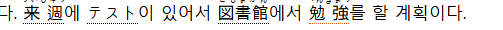
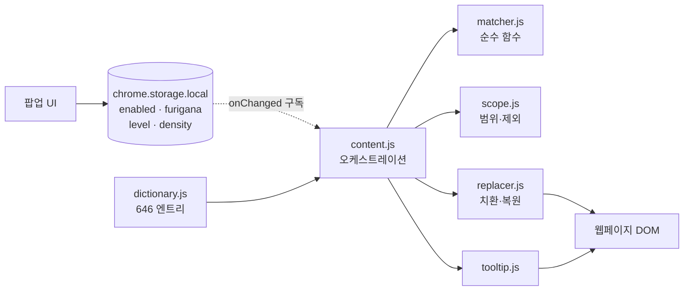

# KoJa

**한국어 웹페이지의 명사를 일본어 표기와 후리가나로 치환하는 Chrome 확장**

따로 시간을 내서 외우는 대신 평소 웹서핑 중에 일본어 어휘 노출량을 만드는 방법을 다룬
**바이브코딩 특강 해커톤** 결과물입니다. 3인이 하루 만에 설계·구현·실측까지 완주했습니다.

```
원본 페이지                        확장 적용 후
─────────────────────────         ─────────────────────────
오늘 아침에 학교 앞 카페에서        今朝(けさ)에 学校(がっこう) 앞 喫茶店(きっさてん)에서
친구를 만났다. 시간이 없어서        友達(ともだち)를 만났다. 時間(じかん)이 없어서
커피만 마시고 바로 회사로 갔다.     コーヒー만 마시고 바로 会社(かいしゃ)로 갔다.
```

괄호 안 가나는 실제로는 한자 위에 `<ruby>`로 얹힙니다. 조사와 문장 구조는 건드리지 않습니다.
문맥은 모국어로 남겨두고 단어의 형태와 읽기에만 인지 자원을 쓰게 하는 것이 설계 의도입니다.


- **바이브코딩 특강 해커톤** — 2026년 8월 19일 하루(약 13시간), 3인 팀, 커밋 41개
- Chrome Manifest V3, **런타임 네트워크 호출 0건**(번역 API·LLM 미사용). 사전 646개를 번들로 싣습니다
- 자동 테스트 36개, 사전 빌드가 불변식 8종을 강제
- 3사이트 실측으로 오탐 4건을 찾아 제거
- 담당: 레인 C(데이터·셸·UI) 및 통합자

> 이 문서는 저장소의 코드와 검증 기록을 기준으로 썼습니다. 설계 근거는 [`SPEC.md`](SPEC.md),
> 인터페이스 계약은 [`plan.md`](plan.md), 진행 기록은 [`tasks.md`](tasks.md)에 있습니다.
> 문서의 `D1`·`D2`·`D3`는 날짜가 아니라 **작업 단계**입니다. 3일치로 설계한 계획을 하루에 압축했습니다.

## 설치

```bash
git clone https://github.com/Jossi02/chrome-jlpt-word-replacer.git
cd chrome-jlpt-word-replacer
npm test        # 36/36. 의존성 설치 없이 Node만 있으면 됩니다
```

`chrome://extensions` → 개발자 모드 ON → **압축해제된 확장 프로그램을 로드** → 이 폴더 선택.
한국어 페이지를 열면 조작 없이 단어가 바뀝니다. 툴바 아이콘에서 켜기/끄기, 후리가나 토글,
레벨(N5\~N1), 밀도(0\~100%)를 조절합니다.

시연 페이지는 로컬 서버로 엽니다. `file://`은 콘텐츠 스크립트에 별도 권한이 필요합니다.

```bash
npx --yes http-server -p 8000 .
# http://localhost:8000/demo/sample.html
```

권한은 `storage` 하나입니다. 설치 시 "모든 웹사이트의 데이터 읽기" 경고가 뜨는데, 텍스트를 바꾸려면
텍스트를 읽어야 하기 때문이며 외부로 나가는 데이터는 없습니다.

## 왜 한국어 → 일본어인가

한국인은 한자어를 이미 압니다. 「時間」「学校」「安全」은 배우지 않아도 뜻이 짐작됩니다. 시작점이 0%가
아니라서 첫날부터 치환된 단어의 상당수가 바로 읽힙니다. 이 이점은 한국어·중국어 사용자에게만 있고,
영어권 사용자를 대상으로 하는 유사 도구(Toucan 등)는 활용할 수 없습니다.

대가는 거짓짝입니다. 「勉強」은 면강이 아니라 공부고 「大丈夫」는 대장부가 아니라 괜찮다는 뜻인데,
사용자는 틀렸다는 신호를 못 받은 채 확신합니다. 대부분은 사전을 만들 때 걸러냈고, 확실한 사례
(「勉強」)는 남겨두는 대신 밑줄 색을 다르게 표시합니다.



바로 앞 「図書館」은 기본 밑줄, 「勉強」만 주황색입니다. 툴팁 내용은 다른 단어와 똑같이 원본 한국어와
읽기 2줄뿐입니다 — 경고 문구를 추가하면 툴팁이 상시 참조 도구가 되어 버리므로, 색 하나로만 신호를
줍니다. 사전 엔트리에 `falseFriend: true` 한 줄만 추가하면 되는 구조라 후보를 찾을 때마다 넓힐 수
있습니다.

## 까다로웠던 부분

### 형태소 분석기 없이 어절 경계 잡기

한국어는 조사가 명사에 붙습니다. 「경제」를 찾으려면 「경제가」「경제를」「경제에서는」을 다 잡아야 하는데
「경제학」과 「신경제」는 잡으면 안 됩니다. 형태소 분석기는 확장 크기가 부담이라 조사 목록과 앞뒤 경계
검사로 처리했습니다.

| 입력 | 결과 | 근거 |
| --- | --- | --- |
| `경제가 나빠졌다` | 経済가 나빠졌다 | 조사 「가」를 경계로 인정 |
| `경제학 개론` | 치환하지 않음 | 표면형 뒤에 한글이 이어짐 |
| `신경제 정책` | 치환하지 않음 | 표면형 앞에 한글이 붙음 |
| `2시간 걸렸다` | 치환하지 않음 | 앞이 숫자. 경계 문자에 `0-9`가 없으면 「2」+ 時間으로 깨짐 |
| `아주머니가 왔다` | 伯母さん가 왔다 | 최장 일치로 「주머니」로 쪼개지지 않음 |


시연 페이지에 넣어둔 함정 케이스입니다. 위 상자는 통째로 치환되어야 하고, 아래 상자의 「경제학」
「2시간」「신경제」「10년간」「3주말」은 한국어로 남아야 합니다. 같은 문장의 「수업」과 「기록」은 치환됩니다.

최장 일치는 정규식 alternation이 왼쪽부터 평가되는 성질을 이용했습니다. 표면형을 길이 내림차순으로
정렬해 넣으면 긴 쪽이 먼저 잡힙니다. 이 정렬이 빠지면 「아주머니」가 「주머니」로 쪼개지므로, 사전
빌드가 산출하는 부분 문자열 쌍 74건을 그대로 테스트 케이스로 씁니다.

### 같은 페이지는 항상 같게 보여야 한다

밀도 슬라이더에 `Math.random()`을 쓰면 새로고침마다 화면이 달라져 시연을 못 합니다. 그래서 페이지
전체를 관통하는 러닝 카운터로 균등 간격 선택을 합니다. 이 카운터를 텍스트 노드마다 초기화하면 모든
노드의 첫 후보가 통과해 슬라이더가 사실상 안 먹는데, 이 부분은 구현보다 테스트를 먼저 썼습니다.

### 껐을 때 원문 그대로 돌아오기

치환은 텍스트 노드를 쪼개 span을 끼우는 작업이라 되돌리면 노드가 파편화된 채 남습니다. 복원 후 부모에
`normalize()`를 부르지 않으면 켜고 끄기를 반복할수록 어절이 붙거나 벌어집니다. 3사이트에서 3회씩
왕복시켜 서버 원본과 텍스트가 일치하는지 확인했습니다.

### 나머지

- **입력창 보호** — `input`/`textarea`/`contenteditable`/`pre`/`code` 안의 텍스트는 조상 방향으로
  거슬러 올라가며 차단합니다. 검색창에 쓴 글자가 바뀌어 전송되면 사고입니다.
- **MutationObserver 무한 루프** — 확장이 넣은 span이 다시 관찰자를 깨우면 탭이 얼어붙습니다.
  `.koja-word` 하위 변경은 무시하고, 디바운스 후 disconnect한 다음 스캔합니다.
  문제가 생기면 `USE_OBSERVER` 상수로 한 줄에 끌 수 있게 뒀습니다.
- **MV3** — 선언형 콘텐츠 스크립트는 ES 모듈을 못 씁니다. `import`를 쓰면 오류도 없이 아무것도 동작하지
  않습니다. 모듈 6개가 `window.KOJA` 하나에 붙고 manifest의 `js` 배열 순서가 곧 의존 순서입니다.

## 구조

매칭 로직을 DOM에서 떼어놨습니다. `matcher.js`는 문자열을 받아 매치 목록을 돌려주는 순수 함수라
브라우저 없이 `node --test`로 검증됩니다.



착수 전에 모듈 간 시그니처 7개를 확정하고 빈 껍데기를 먼저 커밋했습니다. 3인이 서로를 기다리지 않고
병렬로 작업한 근거입니다. 계약 전문은 [`plan.md`](plan.md)에 있습니다.

계약의 핵심은 `surface`를 돌려주는 것입니다. 별칭 「생선」으로 잡았으면 툴팁과 복원값 모두 대표 표제어
「물고기」가 아니라 페이지에 실제로 있던 「생선」을 써야 합니다.

설정은 `chrome.storage.local` 4개 키뿐이고 팝업과 콘텐츠 스크립트는 `storage.onChanged` 구독 하나로만
통신합니다. `tabs.sendMessage`는 쓰지 않습니다. 두 경로가 함께 있으면 상태가 갈라집니다.

<table>
<tr>
<td width="60%"></td>
<td width="40%"></td>
</tr>
</table>

툴팁은 페이지에 있던 한국어와 읽기 2행만 보여줍니다. 영어 뜻이나 예문을 넣지 않는 이유는 툴팁이 상시
참조 도구가 되면 줄이려던 번역 경로를 오히려 강화하기 때문입니다.

## 사전

`data/dictionary.json`이 사람이 고치는 정본이고, Python 빌드가 불변식 8종(표제어 중복, 표면형 전역 충돌,
한 글자 표면형 금지, `ruby` 플래그 정합 등)을 검사한 뒤 번들과 테스트 데이터를 생성합니다.

```
$ PYTHONIOENCODING=utf-8 python tools/build_dictionary.py
OK — 불변식 8종 전부 통과
  엔트리      : 646  (N5 327 / N4 105 / N3 95 / N2 70 / N1 49)
  매칭 표면형 : 677  (대표 646 + 별칭 31)
  ruby 대상   : 542  / 가나 전용 104
  → data/dictionary.js (82.4 KB)
  → data/substring-pairs.json
```

한 글자 표면형을 전량 금지한 것이 오탐 감소에 가장 크게 기여했습니다. 「상」「중」「전」 같은 한 글자
명사는 어디에나 부분 문자열로 들어가 오탐 대부분을 만들므로, 규칙으로 걸러내는 대신 입력에서 없앴습니다.

## 검증

| 항목 | 범위 | 결과 |
| --- | ---: | ---: |
| 자동 테스트 | `node --test` 36건 | 36 통과 / 0 실패 |
| 실측 사이트 | 데모 · 위키백과 · 뉴스 기사 3곳 | 명백한 오치환 0건 |
| 안전성 회귀 | 3사이트 × 6항목 | 17 통과 / 1 해당없음 |
| 무손실 복원 | 3사이트 각 3회 왕복 | 원본과 텍스트 완전 일치 |
| 콘솔 에러 | 3사이트 각 재로드 3회 | 0건 |

규칙을 통과하는 오탐은 실제 사이트를 읽어야 나옵니다. N1·밀도 100%로 3사이트를 훑어 4건을 찾았습니다.

| 오탐 | 실제 문장 | 원인 | 처리 |
| --- | --- | --- | --- |
| 바람 | 잘못 기록하는 바람에 | 관용구를 명사 「바람」(風)으로 인식 | 규칙 예외, 단어 유지 |
| 사전 | 사전 투표는 선거일 5일 | 事前(미리)과 辞書(책) | 엔트리 삭제 |
| 고려 | 중세 국가인 고려(高麗) | 고유명사와 考慮(숙고) | 엔트리 삭제 |
| 상의 | 동해 상의 독도 | "상"+조사"의"가 上着와 일치 | 별칭만 제거 |

원칙은 오탐 하나에 단어 하나 제외입니다. 규칙을 고치면 74쌍 테스트와 경계 규칙이 함께 흔들리는데 단어를
빼면 아무것도 흔들리지 않습니다. 「바람」만 규칙으로 처리한 건 이 관용구가 항상 `~는 바람에` 형태로만
나오기 때문입니다. 반면 「사전」은 뒤에 붙는 말이 계속 늘어나(사전 투표·예약·신청) 국소 규칙으로 구분할
수 없다고 판단했습니다.

개발 PC의 Chrome에서 수행한 검증이며 웹스토어 심사나 다양한 사이트 유형에 대한 일반화를 입증한 것은
아닙니다. 기록은 [`docs/misfires.md`](docs/misfires.md)와 [`docs/d3-3-safety.md`](docs/d3-3-safety.md)에
있습니다.

## 나의 주요 기여

> 3인 팀 해커톤이며 확장 전체를 단독으로 구현하지 않았습니다. 매칭 로직(레인 A)과 DOM 조작 계층(레인 B)은
> 다른 팀원이 담당했습니다. 아래는 [`OWNERS.md`](OWNERS.md)의 파일 단위 소유권 기준입니다.

- 레인 C(데이터·셸·UI) 담당 및 통합자 겸임
- 사전 정본 설계와 Python 빌드 파이프라인 구현(불변식 8종 검증, 번들·테스트 데이터 생성)
- `manifest.json`, 팝업 UI, `content.css` — 로드 순서 고정, 권한을 `storage` 하나로 제한, ruby 표시
- 함정 케이스를 내장한 시연 페이지와 오프라인 백업 페이지
- 파일 단위 소유권 하네스(`.claude/`) — 편집 시 문법 검사, 세션 종료 시 테스트·리뷰 게이트
- 3사이트 실측 주도 및 오탐 4건 분류·처리, 기준 문서 관리와 브랜치·PR 통합

### AI 활용과 사람이 판단한 것

특강 주제가 바이브코딩이었으므로 구현 전반에 [Claude Code](https://claude.com/claude-code)를 썼습니다.
숨길 전제가 아니라 이 프로젝트의 방식이었고, 그래서 제 기여의 실질은 코드 타이핑이 아니라 **하루 동안
3인 + AI가 만든 산출물이 서로 어긋나지 않게 만든 구조**에 있습니다.

- **인터페이스 계약을 코드보다 먼저 확정**했습니다. 시그니처를 합의하고 빈 껍데기를 커밋했기 때문에
  세 사람이 서로의 구현을 기다리지 않았습니다.
- **검증을 사람의 주의력에 맡기지 않았습니다.** 사전은 빌드가 불변식을 강제하고, 문법 검사와 테스트
  게이트를 훅으로 걸었습니다. 빠르게 생성한 코드가 조용히 깨지는 것을 막는 장치입니다.
- **완료 기준을 "그 화면을 실제로 봤다"로 정의**했습니다. 실제로 이 규칙 때문에 밀도 슬라이더 항목
  2개를 미완료로 남겼습니다.

빠르게 만드는 것보다 **빠르게 만든 것이 맞는지 확인하는 절차**가 병목이라는 점이 이 해커톤의 결론입니다.

## 한계

- **레벨 표기는 추정치입니다.** JLPT는 2010년부터 공식 단어 목록을 공개하지 않아 시중 단어장은 전부
  추정판이며 서로 다릅니다. 표기·후리가나·표제어·레벨은 직접 작성했습니다.
- **조사 목록 방식은 완전하지 않습니다.** 어절 끝만 검사하므로 의미를 판별하지 못하고, 새 오탐 유형은
  계속 나올 수 있습니다. 위 4건이 그 예입니다.
- **복습 장치가 없습니다.** 학습 기록·통계를 범위 밖에 뒀으므로 학습 앱으로 제시하지 않습니다. 노리는
  것은 이미 이해한 문맥에서 형태를 반복 마주치는 우연적 학습입니다. 명사만 바꾸므로 독해 향상도
  입증하지 않습니다.
- **하루라는 일정이 곧 한계입니다.** 실측은 3사이트에 그쳤고 오탐도 거기서 눈에 띈 것만 잡았습니다.
  사이트를 넓히면 새 오탐이 나올 것이라고 보는 편이 맞습니다.

## 함께 만든 사람

| | 담당 | 맡은 일 |
| --- | --- | --- |
| [@kimminje2](https://github.com/kimminje2) | 레인 A · 로직 | 최장 일치 매처, 조사·경계 규칙, 밀도 step, 사전·매처 테스트 |
| [@hersmen98](https://github.com/hersmen98) | 레인 B · DOM | 범위 판정과 제외 규칙, ruby 치환·무손실 복원, 툴팁, 스캔 오케스트레이션 |
| [@Jossi02](https://github.com/Jossi02) | 레인 C · 데이터·셸·UI (통합자) | 사전 파이프라인, manifest, 팝업·CSS, 시연 페이지, 하네스, 실측·통합 |

`src/`를 세 사람이 나눠 쓰기 때문에 폴더가 아니라 **파일 단위로 소유권을 나눴습니다.** 공유 파일 없이
모든 파일에 주인이 한 명씩 있고, 브랜치를 레인과 1:1로 두고 PR로만 합쳤습니다. 하루짜리 일정에서는
병합 충돌 한 번이 전체를 멈출 수 있기 때문입니다. 상세 소유권은 [`OWNERS.md`](OWNERS.md)에 있습니다.

이 README는 레인 C 관점에서 정리한 것이므로, 매칭 로직과 DOM 계층의 설계 의도는 해당 담당자의 설명이
더 정확합니다.

---

Chrome MV3 · 브라우저 전역 스크립트 · `node --test`(Node 24) · Python 3(사전 빌드 전용) · 런타임 의존성 없음
